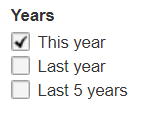
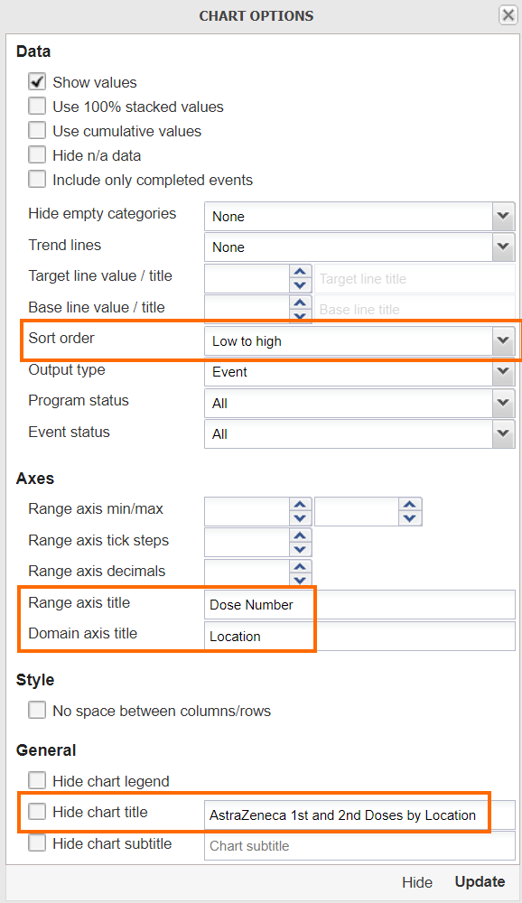
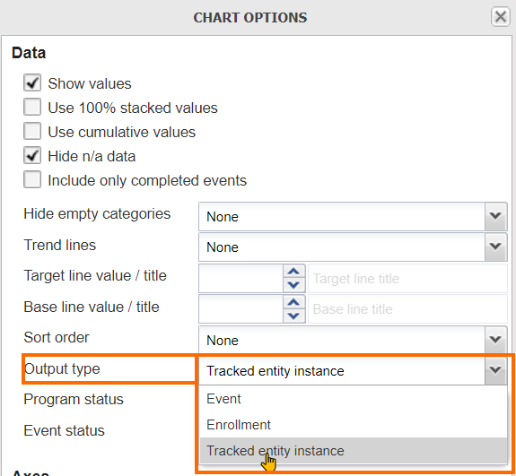
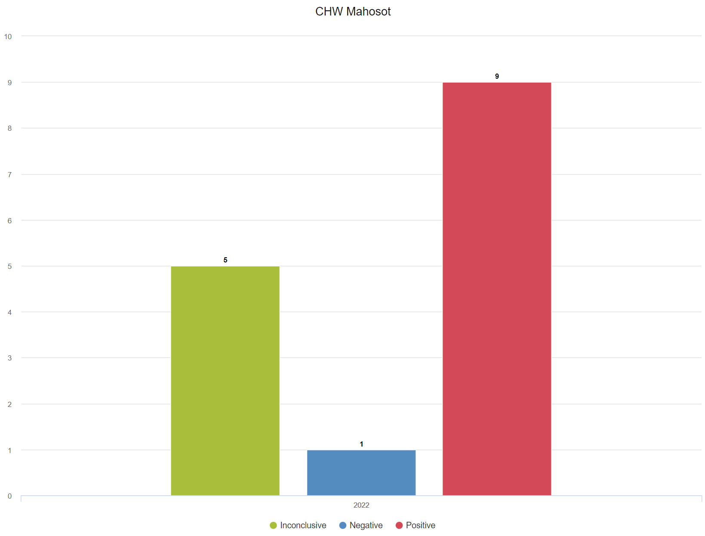

# Learner's Guide to Event Visualizer

## What is this guide?

This guide contains all exercises and detailed steps to perform them related to the use of event visualizer for the Tracker Use Level 1 academy. Please perform each of the exercises when prompted to by your instructors

## Learning objectives for this session

The overall objective of this session is to use the DHIS2 event reports app to review ***tracker*** data. Detailed objectives include:

1. Describe the functions of the event visualizer app
2. Describe the event visualizer interface
3. Create visualizations using tracker data
4. Describe the limitations of event visualizer when working with tracker data

## Exercise 1

### Review and create the chart "COVAC - AstraZeneca 1st and 2nd Doses by Location"

Open the chart "COVAC - AstraZeneca 1st and 2nd Doses by Location" within event visualizer.

Event visualizer is particular adept at supporting outputs within both event and tracker programs as it relates to the visualization of data elements using option sets. We can quite easily combine various filters across different data elements and option sets to see an aggregate representation of the cross section of these filters as applied to our data.

This is the scenario we see with the chart that we are reviewing.

Review the Data Panel in particular.

We see here there is no output type selection here, just the program and the program stage. We are able to actually output a count of TEIs by using the options and this will be shown. We can not however combine data from multiple stages in event visualizer; charts using data from multiple program stages must be handled through the use of program indicators and data visualizer.

As a review, you can re-create this chart. It has the following inputs:

- Program : COVID- COVID-19 Vaccination Registry, Stage: Vaccination
- Data : Dose Number : 1st dose, 2nd dose, Vaccine Name : AstraZeneca
- Period : This Year
- Org Unit : All level 2 OUs

1. Favorites -> New
2. Select the program (COVAC - COVID-19 Vaccination Registry) and stage (Vaccination)
   1. Note here again there is no enrollment output type , event visualizer is using the "event" output type by default; meaning all events in across all stages are counted in the totals being displayed
3. Select the data (Dose Number : 1st dose, 2nd dose, Vaccine Name : AstraZeneca)

3. Select the Period (This Year)

4. Select the org unit (All provinces, or user sub-units)

5. Modify the layout

Update the chart to review your output.

The chart is not sorted and does not have a title as is the case with the saved chart reviewed earlier. You can open up the options panel and add in these details.

Then proceed to update your chart to view the final output. 

#### Other features as a refresher

You can also save the chart using the favorites menu

 

and download the chart

## Exercise 2

### Review and modify the chart "COVID_CBS - Test Results"

Open the chart "COVID_CBS - Test Results." Nothing so unique about this chart; however we can note that it using data from Stage 3 - Lab Results in the surveillance program. This stage is repeatable, and by default we are seeing all of the events in this program stage being displayed on the chart.

Rather then counting the total number of tests with these results, what if we wanted the number of unique people with these test results? In event reports, we were able to use the enrollment type output to both count enrollments as well as combine data from multiple stages in one list. We do not have that option here, but we can count the number of tracked entities.

Open the chart options and review the output type

We can see there are 3 options:
1. Event
2. Enrollment
3. Tracked Entity Instance

***NB***: Enrollment does not work as we can not pull data from multiple stages in event visualizer. It seems to be there incorrectly. Please ignore this option.

Select the option "Tracked entity instance" and update the chart. You should see a a few less positive cases identified within this org unit when compared to the previous chart, as it is counting the number of TEI's uniquely, rather then counting the number of events matching the criteria of your filter(s).

> Why the different language between event reports and event visualizer regarding the output type? The Enrollment output type in event reports allows you to display information unique to an enrollment, as well as obtain data across an entire enrollment (meaning you can review data from multiple program stages together in the line list; and obtain unique counts via the pivot table). The "Tracked entity instance" output type in event visualizer is much more limiting. It does not allow you to pull data from multiple program stages; it just let's you count the number of unique tracked entities (in this case individual people) that meet the criteria you have set via your filters within a program stage 1 or more times. This can be useful but it is important to identify this distinction.