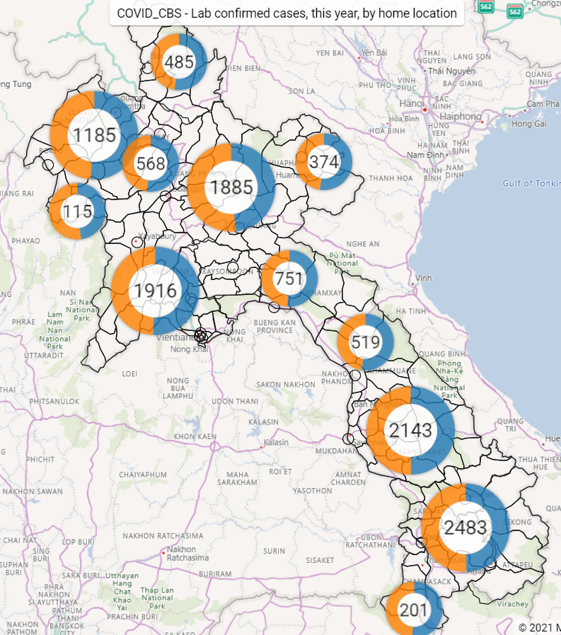
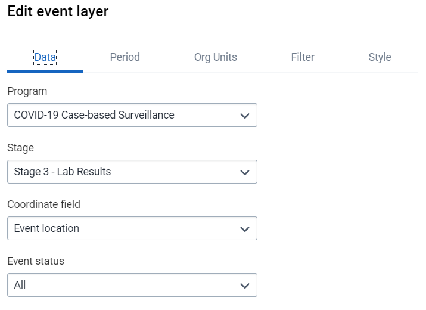
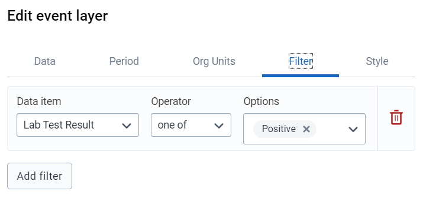
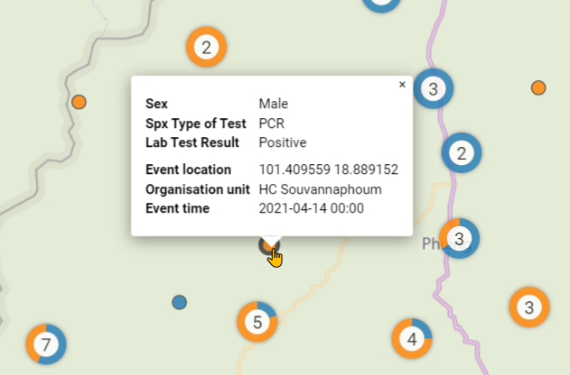
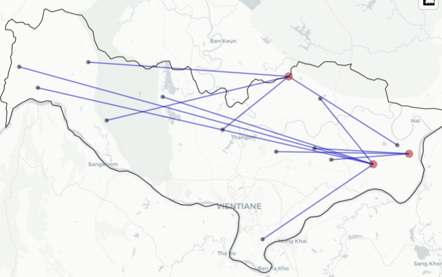
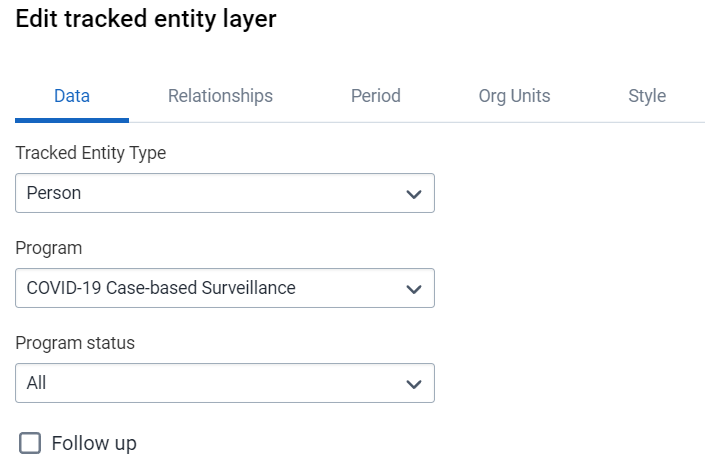
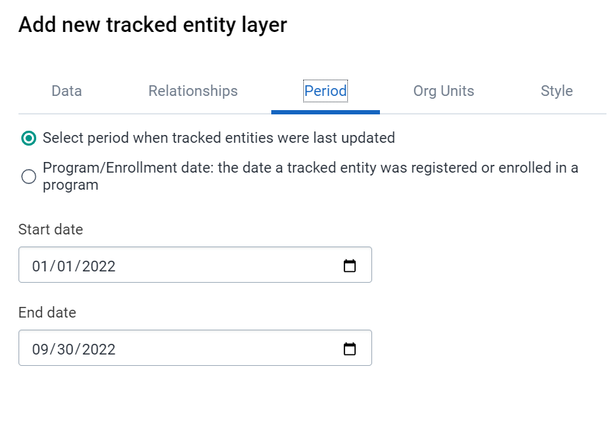

# Learner's Guide to Maps - Event and TEI Layer

## What is this guide?

This guide contains all exercises and detailed steps to perform them related to the use of ***maps - event and tracked entity layer*** for the Tracker Use Level 1 academy. Please perform each of the exercises when prompted to by your instructors.

## Learning objectives for this session

1. Describe the maps app as it relates to tracker data
2. Describe the limitations of maps when working with tracker data
3. Create maps using tracker data within:
   1. The event layer
   2. The tracked entity layer

## Exercise 1

### Create a map using the event layer

Please create a map using data from the COVID-19 Case-Based Surveillance Program for lab confirmed cases.

Create the map using the event layer with the following inputs:

- Layer Type : Event 
- Data:
  - Program : COVID-19 Case-base Surveillance
  - Stage : Stage 3 - Lab Results
  - Coordinate field : Event Location
  - Event status : all
- Period : This Year
- Org Units : User org units 2x below
- Filter :
  - Data item : Lab Test Result = Positive
- Style :
  - Group events
  - Style by data element : Sex

The map is saved as ""COVID_CBS - Lab confirmed cases, this year, by home location" for refence.

**Data Tab**

**Period Tab**

**Org Units Tab**

**Filter Tab**

**Style Tab**

As the events are grouped together, and you have chosen to style them by sex, we see the doughnut charts when we are zoomed out. As you zoom in however you will start to see the individual locations of each of these events. Select an event to see the details. 

As we can see, using this layer is the same whether we are using event or tracker data. As with our other analyses, we do have to keep in mind that the event layer will be displaying all the events within a program on this map; so in the case of repeated event data you can have multiple events on the map representing each of these events.

## Exercise 2

### Create a map using the TEI layer with relationships

We will now create a map using data from the COVID-19 Case-Based Surveillance Program where we will display relationships on the map.

Create the map using the tracked entity layer with the following inputs:

- Layer 1 Type : Boundary Layer - Vientiane Capital
- Layer 2 Type : Tracked Entity
- Data:
  - Tracked Entity Type : Person
  - Program : COVID-19 Case-base Surveillance
  - Program status : all
- Relationships : 
  - Display tracked entity relationships = yes
  - Relationship type : Has Been in Contact with
- Period :
  - Program/Enrollment date
  - Start/ End Date : Oct 16, 2020 - Oct 16, 2021
- Org Units : CHW Mitthaphap
- Style : leave as default

The map is saved as "COVID_CBS - Cases and Contacts" for reference.

**Boundary Layer**

---

***Tracked Entity Layer***

**Data Tab**

**Relationships Tab**

This tab allows you to show relationships between tracked entities, but has a large warning message as it is still in development.

One of the main drawbacks when using the relationship layer is that it only allows you to display relationships within the same program. In our example, we actually have a separate program for registering contacts, but we are not able to display the relationships between the surveillance program and the contacts program; we can only display relationships within the surveillance program (ie. both the cases and contacts must be in this program). Applied more generally, this means that you are only able to display relationships within the same program on the map currently using the tracked entity layer.

**Period Tab**

**Org Units Tab**

**Style Tab**

In the style tab, you can select the colour of the tracked entity, its related entities and the line used to represent the relationship. This allows you to customize the output of these relationship outputs slightly when creating the map layer.

#### Review the map output along with limitations of this layer

As we can see, we are able to display tracked entities along with their relationships using this layer. We have already discussed that we are only able to display relationships within the same program currently, but in addition you are not able to apply any event data to filter out the tracked entities that you are showing. Therefore, ***the tracked entity layer can not be combined with any information from the events within a program stage.***

This is unfortunate, as it requires us to collect co-ordinates for every event within a tracker program, rather then just being able to collect the coordinate once and using it in conjunction with our event data.

This is something that is being worked on however and is expected in future releases.