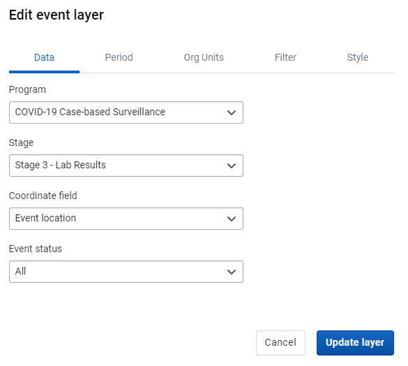
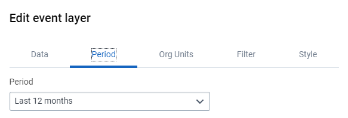
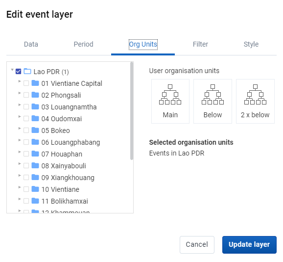
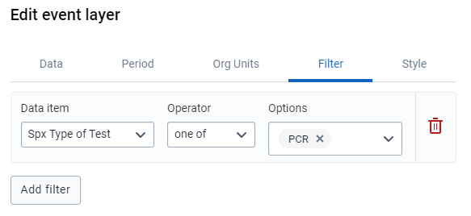
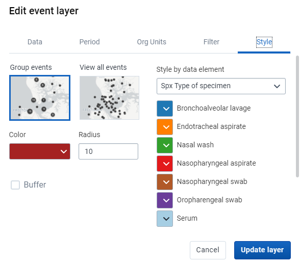
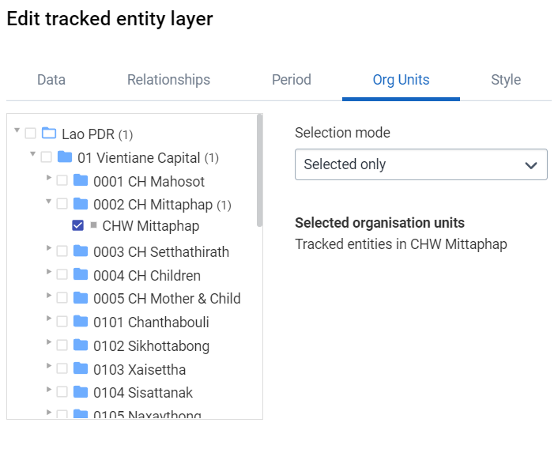

# Maps - Event and TEI Layer - Session Summary

- Mapping our data within the event or tracked entity layer requires that co-ordinates are collected during data entry
- We can map events within a tracker program the same way we map event data when using the event layer
- We can map tracked entities using the tracked entity layer. This layer allows us to show relationships in the same program
- The tracked entity layer also has some limitations:
  - We can not use any event data in conjunction with the tracked entity coordinate
  - Can not show any relationships on the map between different programs
- We can also map data using program indicators, please refer to that sessions material for more information

## Creating a map using the event layer

1. In the maps app, go to Add layer -> event layer
2. You will have 5 tabs that you should fill out in sequence
   1. Data tab : Select the program, program stage, coordinate field and event status

    

   2. Period tab : Select your period

    

   3. Org Units tab : Select your org units

    

    
   4. Filter tab : Select the criteria for events that you want to filter out from your map. Only events that meet your criteria will be shown on the map

    

   5. Style tab : There are several options on the style tab that will affect the output of your map
      1. Group events vs. view all events
         1. Group events : When you have many events, it is often useful to group them together. As you zoom in these will start to separate into the individual detail
         2. View all events : if you are working with a subset of your data, you may want to view all events immediately. If you have many events and choose this option, your map will not be useful when zoomed out.
      2. Color/Radius : this will determine the color/radius of your grouped or individual events if no style has been applied to them
      3. Style by data element : This is useful to assign color schemes to our events using two data types
         1. Data items that contain option sets : A color will be assigned to each option within the option set
         2. Data items that use a number : A color will be assigned to them using either an automatic or pre-defined legend
         3. This option will ignore any color option you have selected previously in the "color" section

    

3. It is also typically a good idea to add a boundary layer to a map using an event layer by going to Add layer -> Boundaries and selecting the level or group you want to add the boundary for

## Create a map using the TEI layer

1. In the maps app go to Add layer -> Tracked Entities
2. You will have 5 tabs that you should fill out in sequence
   1. Data tab : Select the tracked entity type, Program and Program status

   1. Relationships tab : Check "Display Tracked Entity relationships" and select the relationship type

   1. Period tab : Select the period type along with the start and end date

   2. Org Units tab : select the org unit and the selection mode

   3. Style tab 
      1. Select the color and size of the tracked entity
      2. Select the color and size of the related entity
      3. Select the color of the line used to connect the tracked entity and related entity

## Save a map

Go to the file menu and select the "Save" option

Give the map a name and a description and select "Save"

## Download a map

Select the download option from within the app. This will open up a new dialog. Position your legend where you want it and select "Download" to download the map. This will download a PNG file of the map to your downloads folder.

