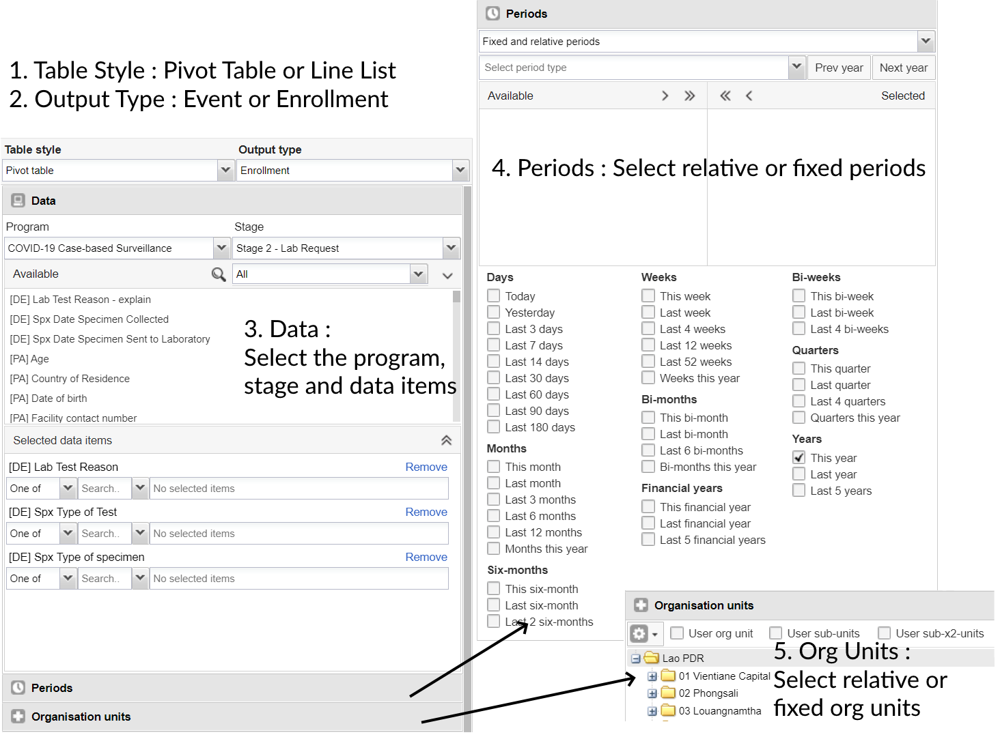
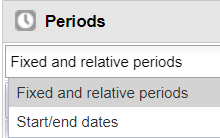

# Trainer’s guide to Event Reports (Web-Based)

## What is this guide?

This guide is a support document for DHIS2 Academy trainers for the session “Event Reports.” This session follows the standard Academy training approach with 

1. a live demo session where the trainer demonstrate and explain the features, and 
   
2. a hands-­on session with exercises where participants get to practice the same features.

This guide will help the trainer​ prepare​​ for the live demo session. The “Live Demo step by
step” section has a detailed walkthrough of all the steps to demonstrate with
explanations and screenshots that should be easy to follow. Use that when preparing for
the live demo session.

There is also a Quick Guide which lists the steps very briefly and this is meant as a lookup
guide or “cheatsheet” WHILE doing the demo, to help the trainer remember all the steps
and the flow of the demo.

## Learning objectives for this session

The overall objective of this session is to use the DHIS2 event reports app to review ***tracker*** data. Detailed objectives include:

1. Explain the difference between event and enrollment type reports
2. Design event reports using tracker data
3. Design event reports showing data from multiple tracker program stages
4. Describe the differences between how repeated and non-repeated stage data is displayed

## Time Requirements

Live Demo: 3 demos, 
Hands-on Exercises: 3 exercises, 
Assignment: 

## Background

This session build on concepts introduced during the event fundamentals course. In the events fundamentals course, the learner would review how to create an event reports for a single event, creating both line-lists as well as aggregated reports. While this will be quickly reviewed within this session, a number of additional concepts not discussed (as outlined in the learning objectives) will also be covered. For this reason, the beginning part of the guide is brief as is assumed the learner is familiar with these concepts. If this is not the case, you will need to slow down on the explanation of the interface and create some initial reports together.

## Preparations

This session will see you creating a number of reports. Ensure that you have run analytics in the demo database you are using and that all the data is being populated correctly. If you find that data is not present for the correct period or year, please contact the training content team so we can advise how to move the data correctly.

You should consider running through the entire demo prior to presenting it. After this, you should take the quick guide and supplement it with any additional notes you made while running through the demo. If you identify any changes that may be required or additional explanation that would be helpful within the session, please content the training content team in order to allow us to evaluate how to best integrate this feedback into the material.

Also, the learner's guide and session summary are the main material that will be provided to the learner's with both detailed steps for ungraded exercises as well as the key messages from the session. Review these as well to ensure you are able to get these key points across during your demonstration.

## Best Practices

Before starting the demonstration, please keep in mind that the most important thing is that the audience is following, so make sure to ask questions to the audience to verify that they are following. If something is unclear, go back and go through it slowly. If you don’t have time for all the steps, it is better to cut some steps, than to go fast while nobody understands.

In an online setting, you will be breaking regularly to allow them to perform various ungraded exercises in order to keep them engaged.

If the participants are doing the demo with you at the same time, you can take time to go around the audience and help them if the academy is happening onsite. There should be a team of trainers doing this at all times as well.

## Quick Guide

1. Review the event reports interface
2. Create an aggregate/pivot table event report using COVID-19 vaccination containing the following details:
   1. Table Style : Pivot, Output Type : Event
   2. Program : COVAC - COVID-19 Vaccination Registration
   3. Stage : Vaccination
   4. Data : Dose Number (Filter out the 1st dose; both in the data selection as well as in the layout), Sex, Vaccine Name
   5. Period : This year
   6. Org Unit : Country
3. Create a line list event report using COVID-19 vaccination
   1. Modify the previous table to be a line list
   2. Add in some attributes and modify the layout of the table (ie. First name, Surname, Local ID)
   3. Add/remove filters for the data (ie. Dose number, vaccine name)

STOP! Have them perform Exercise 1

4. Create a list event report for a repeatable stage using the COVID-19 surveillance program
5. Create the same report using enrollment as the output type

STOP! Have them perform Exercise 2

6. Create an aggregate/pivot table event report using a repeatable stage
7.  Create an aggregate/pivot table enrollment report using a repeatable stage

STOP! Have them perform Exercise 3

8.  Create a line list report enrollment report using multiple stages from the COVID-19 surveillance program

STOP! Have them perform exercise 4

Once they have completed all of the ungraded exercises, they should then complete the graded assignment

## Live Demo step by step

### Review the events reports interface

#### Periods in Event Reports

In event reports, Periods can be selected as either Fixed or relative periods (same as aggregate) or with specific start/end dates (specific to event/tracker data)

If choosing the start/end dates than you can select exact dates to filter events based on the report date that was entered during event or tracker capture.

#### Create an aggregate/pivot table event report using COVID-19 vaccination

Create an aggregate event report as a quick review for the participants. You can use the following data items as an example:

1. Table Style : Pivot, Output Type : Event
2. Program : COVAC - COVID-19 Vaccination Registration
3. Stage : Vaccination
4. Data : Dose Number (Filter out the 1st dose; both in the data selection as well as in the layout), Sex, Vaccine Name
5. Period : This year
6. Org Unit : Country

The layout will look like this as a reminder

You can modify some of the options, for example hiding empty rows to hide the vaccine with no data, and update the table

#### Create a line list event report using COVID-19 vaccination

Take the pivot table report you have just made and modify the table style to Line list. Add in some attributes like:

- First Name and Surname
- National ID

Before updating the table, open the layout and move the items around in a logical order, noting how this will affect the output of the table.

Proceed to update the table and discuss what is being shown (note: if you still have your filter on for dose 1 in the data, mention that this is still being filtered. You can also add more or less filters to your output so they can see the effect this has if needed)

Modify the filters to see how the line list is updated

You will only see the data which meets this criteria

#### STOP! Have them perform *Exercise 1* in the learner's guide.

### Create a list type event report for a repeatable stage using the COVID-19 surveillance program

Before you create this report, open up a record from tracker capture that has repeated event data. The example used here has the following details that you can search for to find the person's record:

- Program : COVID-19 Case-based surveillance
- Local Case ID : ID-5353942, First Name : Angela, Last Name : Campbell, Sex : Female

Open up this record and navigate to the "Lab Request" stage within this program. Here you will see that there is more then one event assigned to the program. Over the next several demonstrations, we will discuss the difference of event vs. enrollment report types and how repeated stage data is affected by this selection.

Open up the different events within this stage and review the data that is there. The data will not be the same for each of these events making them easy to compare.

Keep tracker capture open on this record and open event reports in a new tab.

We will now proceed to explain the how event and enrollment type reports handle this repeatable stage data. 

Create an event report with the following inputs:

- Table Style : Line List
- Output Type : Event
- Data :
  - Local Case ID : ID-5353942
  - First Name
  - Surname
  - Lab Test Reason
  - Type of test
  - Type of specimen
- Period : Last Year
- Org Unit : CHW Mahosot

This should pull up the respective information two events that we saw when we reviewed this record in tracker capture.

> Now you can explain how the event type report selection affects our output. When we are creating event reports and use "event" as the output type, ALL of the events from within a program stage will be output on our report. There is a limitation here in that we can only pull all of our event data from within one program stage, and as a result there are not really "linked" together as they are separate lines within our report.

We can further demonstrate this concept by showing more repeated event data. Modify the output so you are not filtering by any local case ID and change the period to this year. Try sorting the data by name. You should see more repeated events displayed on this report.

